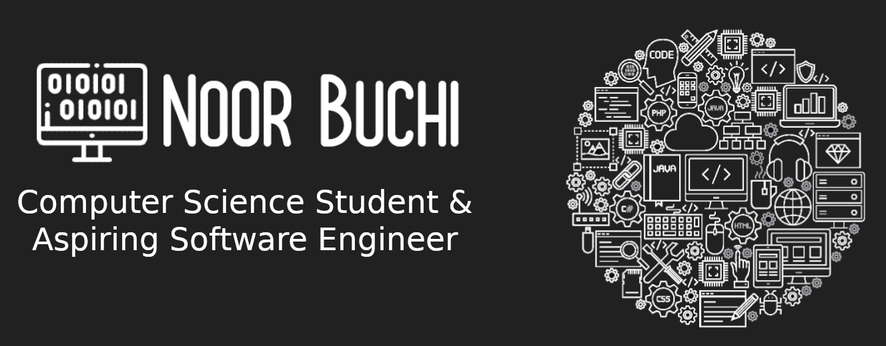

## 
 Hello! I'm Noor  مرحبا! أنا نور

I’m a student at Allegheny College majoring in Computer Science with a minor in
Political Science. I’m currently looking for internships that help me develop
new skills and work with others in the field. Please feel free to check out [my
website](https://noorbuchi.netlify.app/) and reach out using [LinkedIn](https://www.linkedin.com/in/noorbuchi/),
[Twitter](https://twitter.com/BuchiNoor), or [Instagram](https://www.instagram.com/noor_buchi/).

### 📈 Github Stats

